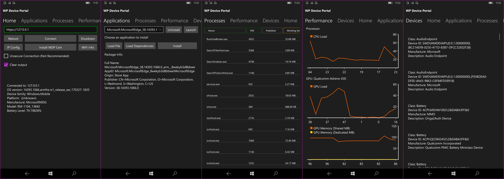

# Windows Phone Device Portal Client
Small tool for easily using Windows Device Portal on Windows 10 Mobile (and Desktop)

*Sadly it's currently broken for some insider builds, the "first" release will be recommended if current builds crash*


## Requirements:
- Windows Device Portal enabled with Authentication Off (Untested with Authentication on, entering Password)
- Windows 10 Mobile (or Desktop) build 14393+



## Whats New?
- Fixed "Connect" Button not showing after failed connection attempt.
- Fixed "Reboot" and "Shutdown" buttons showing after failed connection.
- Fixes to "Check for Update" finding update with wrong address.
- App Install failure message now more readable.
- About page textbox now uses text wrapping (Aimed at small scaling on mobile).
- App Icon on Windows Mobile home page now shows app name.


### Features:
Applications:
- Install
- Uninstall
- Launch
- View Package Information for loaded Appx packages and installed apps

File Management:
- Upload and Download files between connected devices

Processes:
- Running Processes

Performance Info Graphs:
- CPU Load
- GPU
- Network Usage
- I/O Usage

Devices (Basic):
- Hardware Driver Info

Wifi:
- Manage Wifi connections of the connected device.

Debugging:
- Enable Crash Dump settings for Windows and on a Per-App basis **(Desktop only)**
- Monitor ETW logs for various providers

### Notes
- Mobile devices need screen unlocked when connected remotely, this is a Windows Device Portal issue.
- Constant enabling and disabling of any ETW tracing provider will cause a security block on ETW Tracing until reboot.
- Battery drain shouldn't be severe if you leave connected in the background (Windows Device Portal is *always* on when enabled anyway)
- Low End devices may experience lag after loading the Performance tab
- Small scale screens may experience UI overlapping
- (Untested below 1807) Cannot connect to PC from Mobile after 1807 builds
- WDP Username and Password are never saved in this app
- Wifi passwords are stored securely using UWP Certificate API


### Acknowledgements
- This is makes use of the [WindowsDevicePortalWrapper library and UWP sample](https://github.com/microsoft/WindowsDevicePortalWrapper).
- WDPWrapper I have slightly modified to report Platform as Windows for Unknown platforms
- Thanks to [BAstifan](https://github.com/basharast) for variohs contributions to developers
- The graphs were provided by [UWPQuickCharts](https://github.com/ailon/UWPQuickCharts)
- Updates are using Octokit from Github
- ArchiverPlus Library I can't remember which project it came from but it is/was on Github
- Special thanks to the people who help me test
